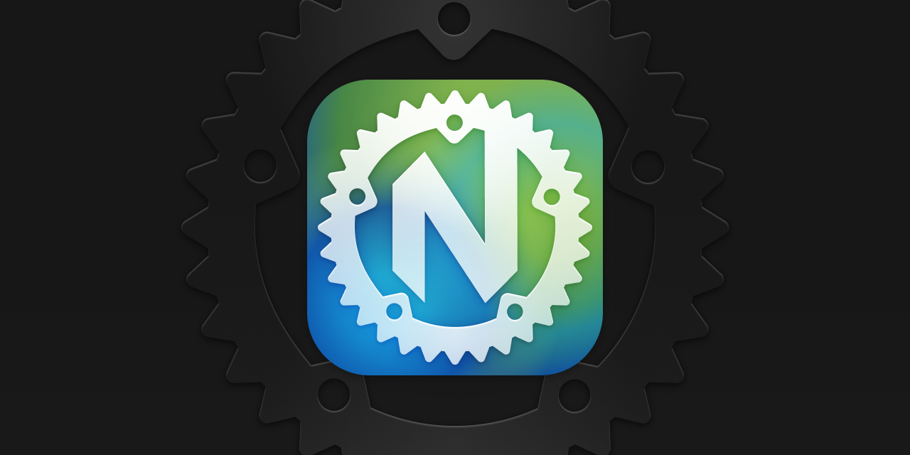

# Alternative (macOS) Icon for Neovide

I only recently gave [neovim](https://neovim.io) a try and quickly found out about the wonderful [Neovide](https://github.com/neovide/neovide) front end. I love it. :c)

This is my take on the Neovide application icon, since I wanted it to fit better in my Dock.

The icon was made with [Figma](https://www.figma.com) and the source file is included (along with an SVG version).

You can create the `.icns` file from the `.iconset` folder on macOS using the terminal:

	iconutil -c icns /path/to/Neovide.iconset

Made by Marc Oliver Orth // marc2o
https://marc2o.github.io